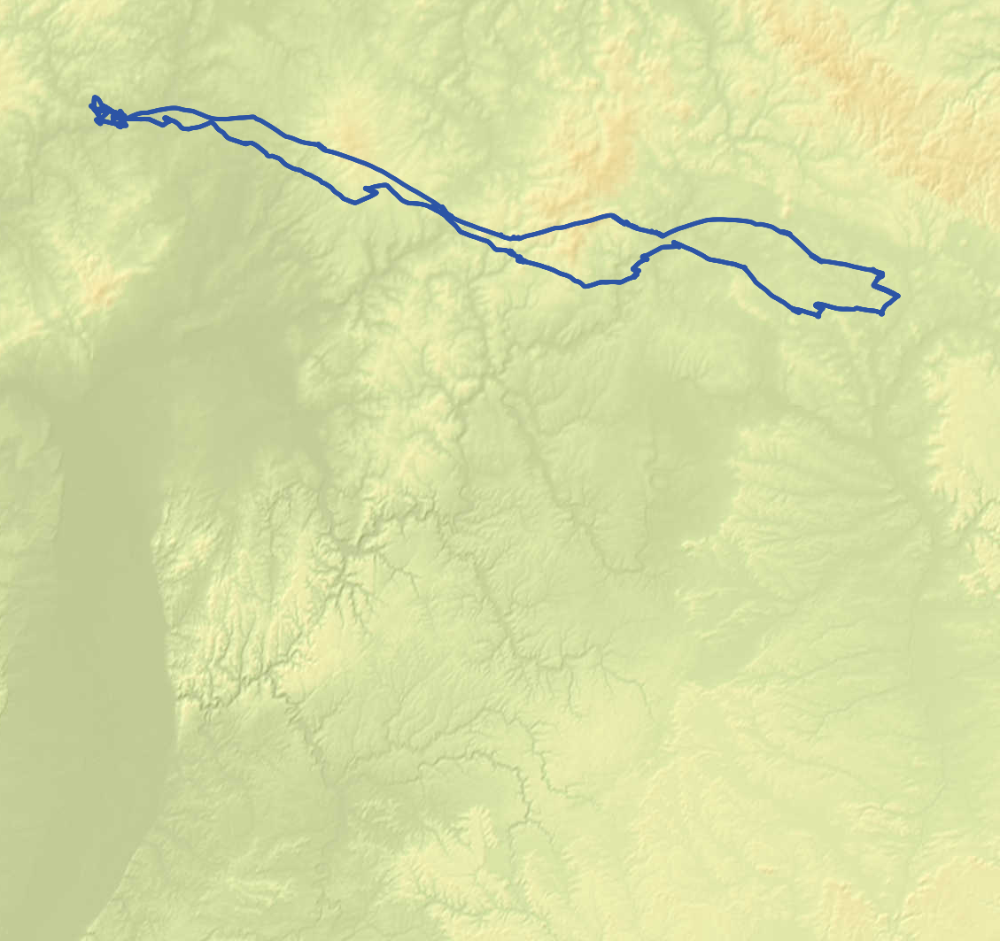

# Casper - static map generator for dynamic data

Casper generates static map images from hybrid map sources (e.g. raster tiles and mapbox vector tiles) and geojson data from postgres.

## Build and run

```shell
go build . && ./casper
```

### CLI Arguments

- `id`: The flight id in the weglide DB
- `th`: Thickness of line string

## Test Cases


```
go test
```

The test cases cover the following scenarios (can be executed **without** a connection to a weglide DB):

- Flight from Berlin to New York
- Flight from Berlin to Hamburg
- Flight from Berlin to Barcelona
- Flight from Berlin to Rio
- Flight from Frankfurt to Marburg

## Prepare Development

1. Clone the [`wg_main`](https://github.com/weglide/weglide) repository
2. Start all the services
3. Make sure that you expose the postgres database with a port mapping: 
    e.g.
    ```
    ports:  
      - 5432:5432
    ```
   With this approach you can connect during the development to the database and don't have to create a docker container separately just to connect to the database.

4. Define the following environment variables:
   ```
    export LOCAL=TRUE
    export POSTGRES_HOST=127.0.0.1
    export POSTGRES_DB=weglide
    export POSTGRES_USER=weglide_user
    export POSTGRES_PASS=test
    export POSTGRES_PORT=5432
   ```

* Canvas starts at top left corner! 

## Example Image



## Data flow

1. Get Flight ID
2. Get bbox (bounding box) and linestring from weglide DB
3. Calculate required tiles based on bbox
4. Download tiles
5. Merge all downloaded tiles to one image
6. Plot flight
7. Crop image